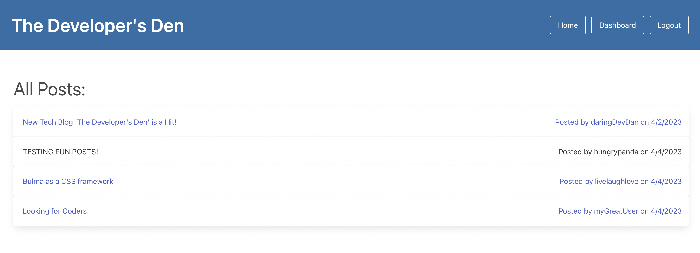

# The Developer's Den

## Description
A developers blog site where users can publish, comment, edit and delete blog posts

## Table of Contents
* [Installation](#installation)
* [Usage](#usage)
* [Credits](#credits)
* [License](#license)
* [Questions](#questions)

## Installation
N/A

## Usage
You can access the deployed website [here!]()

The homepage displays all posts on the site, and can be clicked to be expanded. If you would like to comment or create your own posts, you will need to create an account with a valid username and password.

Once logged in, you can access your dashboard to create a post. You will also see a summary of all your posts, and be able to edit or delete any of them. 

You can also comment on other user's posts.

You are automatically logged off after 15 minutes of inactivity. You can still see posts, but will need to log back in.

## Credits
N/A

## License
  
This application is covered under the MIT license. To learn more, visit the link [here!](https://opensource.org/licenses/MIT)

## Questions
Questions? My Github is [here](https://github.com/phoenixouyang)
